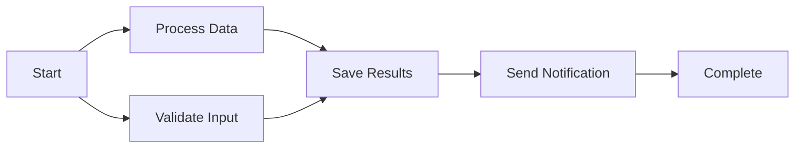
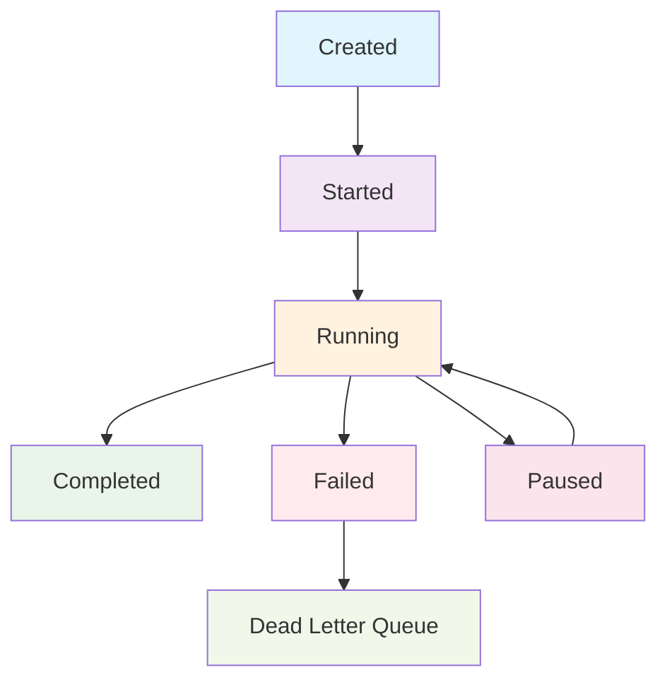

# Core Concepts

This guide covers the fundamental concepts you need to understand to effectively use Flows. By the end of this section, you'll have a solid foundation to build complex, resilient workflows.

## Directed Acyclic Graph (DAG)

At its core, Flows uses a **Directed Acyclic Graph** structure to represent workflows. Understanding this concept is crucial to designing effective workflows.

### What is a DAG?

- **Directed**: Each connection has a direction (from one node to another)
- **Acyclic**: No circular dependencies (prevents infinite loops)
- **Graph**: A collection of nodes connected by edges



### Why DAGs?

DAGs provide several key benefits:

- **Predictable Execution Order**: Dependencies ensure logical flow
- **Parallel Execution**: Independent nodes can run concurrently
- **Error Isolation**: Failures don't create infinite loops
- **Visual Understanding**: Easy to visualise and debug

### DAG Rules in Flows

```typescript
// ✅ Valid DAG - no cycles
const validWorkflow = [
  { id: 'A', dependencies: [] },
  { id: 'B', dependencies: ['A'] },
  { id: 'C', dependencies: ['A'] },
  { id: 'D', dependencies: ['B', 'C'] },
];

// ❌ Invalid DAG - creates a cycle
const invalidWorkflow = [
  { id: 'A', dependencies: ['B'] }, // A depends on B
  { id: 'B', dependencies: ['A'] }, // B depends on A - cycle!
];
```

## Workflows

A **workflow** is a complete definition of a business process represented as a DAG. It contains all the information needed to execute a multi-step operation.

### Workflow Structure

```typescript
interface WorkflowDefinition {
  id: string;              // Unique identifier
  name: string;            // Human-readable name
  description?: string;    // Optional description
  nodes: WorkflowNode[];   // Array of workflow nodes
  version?: string;        // Version for tracking changes
  timeout?: number;        // Global timeout in milliseconds
  metadata?: Record<string, unknown>; // Custom metadata
}
```

### Creating Workflows

```typescript
import { createWorkflow } from 'flows';

const workflow = createWorkflow(
  'order-processing',           // id
  'E-commerce Order Processing', // name
  [                            // nodes
    {
      id: 'validate-order',
      type: 'validation',
      inputs: { rules: 'order-validation' },
      dependencies: [],
    },
    {
      id: 'charge-payment',
      type: 'payment',
      inputs: { gateway: 'stripe' },
      dependencies: ['validate-order'],
    },
    {
      id: 'update-inventory',
      type: 'inventory',
      inputs: { action: 'decrement' },
      dependencies: ['charge-payment'],
    },
  ],
  {                           // options
    description: 'Process customer orders from validation to completion',
    version: '1.0.0',
    timeout: 300000, // 5 minutes
  }
);
```

### Workflow Lifecycle



## Nodes

**Nodes** are the individual steps in a workflow. Each node represents a specific operation or task that can be executed.

### Node Structure

```typescript
interface WorkflowNode {
  id: string;                    // Unique identifier within workflow
  type: string;                  // Node type (determines executor)
  name?: string;                 // Human-readable name
  description?: string;          // Optional description
  inputs: Record<string, unknown>; // Input data for the node
  dependencies: string[];        // Array of node IDs this node depends on
  
  // Optional properties
  timeout?: number;              // Node-specific timeout
  retryConfig?: RetryConfig;     // Retry configuration
  waitForEvents?: string[];      // Events to wait for before execution
  failureHandling?: FailureHandlingConfig; // Node-specific failure handling
  metadata?: Record<string, unknown>; // Custom metadata
}
```

### Node Types

Flows supports built-in and custom node types:

#### Built-in Types

```typescript
// Data node - passes inputs as outputs
{
  id: 'pass-data',
  type: 'data',
  inputs: { message: 'Hello, World!' },
  dependencies: [],
}

// Delay node - waits for specified time
{
  id: 'wait',
  type: 'delay',
  inputs: { duration: 5000 }, // 5 seconds
  dependencies: [],
}
```

#### Custom Types

```typescript
// Custom API request node
{
  id: 'fetch-user',
  type: 'http-request',
  inputs: {
    method: 'GET',
    url: '/api/users/123',
    headers: { 'Authorization': 'Bearer token' }
  },
  dependencies: [],
}

// Custom validation node
{
  id: 'validate-email',
  type: 'email-validation',
  inputs: {
    email: '${previous-node.email}',
    strict: true
  },
  dependencies: ['previous-node'],
}
```

### Node Dependencies

Dependencies define the execution order and ensure data flows correctly:

```typescript
const nodes = [
  // No dependencies - can run immediately
  { id: 'start', type: 'data', dependencies: [] },
  
  // Single dependency - waits for 'start'
  { id: 'step1', type: 'process', dependencies: ['start'] },
  
  // Multiple dependencies - waits for both
  { id: 'combine', type: 'merge', dependencies: ['step1', 'step2'] },
  
  // Parallel execution - both depend only on 'start'
  { id: 'step2', type: 'process', dependencies: ['start'] },
];
```

### Data Flow Between Nodes

Nodes can reference outputs from previous nodes:

```typescript
const nodes = [
  {
    id: 'get-user',
    type: 'http-request',
    inputs: { url: '/api/users/123' },
    dependencies: [],
  },
  {
    id: 'send-email',
    type: 'email',
    inputs: {
      to: '${get-user.email}',        // Reference previous node output
      subject: 'Welcome ${get-user.name}!',
      template: 'welcome'
    },
    dependencies: ['get-user'],
  },
];
```

## Node Executors

**Node Executors** define how different node types are actually executed. They contain the business logic for processing nodes.

### NodeExecutor Interface

```typescript
interface NodeExecutor {
  execute(
    node: WorkflowNode,
    context: Record<string, unknown>,
    inputs: Record<string, unknown>
  ): Promise<unknown>;
}
```

### Default Node Executor

Flows includes a default executor for built-in types:

```typescript
import { DefaultNodeExecutor } from 'flows';

const executor = new DefaultNodeExecutor();
// Handles 'data' and 'delay' node types
```

### Custom Node Executors

Create custom executors for your business logic:

```typescript
class MyCustomExecutor implements NodeExecutor {
  async execute(node, context, inputs) {
    switch (node.type) {
      case 'http-request':
        return this.executeHttpRequest(node, inputs);
      
      case 'email-validation':
        return this.validateEmail(node, inputs);
      
      case 'database-query':
        return this.executeQuery(node, inputs);
      
      default:
        throw new Error(`Unknown node type: ${node.type}`);
    }
  }

  private async executeHttpRequest(node, inputs) {
    const { method, url, headers, body } = inputs;
    const response = await fetch(url, {
      method,
      headers,
      body: body ? JSON.stringify(body) : undefined,
    });
    return response.json();
  }

  private async validateEmail(node, inputs) {
    const { email, strict } = inputs;
    const emailRegex = strict 
      ? /^[^\s@]+@[^\s@]+\.[^\s@]+$/
      : /\S+@\S+\.\S+/;
    
    return {
      valid: emailRegex.test(email),
      email,
      timestamp: new Date().toISOString(),
    };
  }
}
```

### Executor Chaining

Combine multiple executors:

```typescript
class ChainedExecutor implements NodeExecutor {
  private executors: NodeExecutor[];

  constructor(...executors: NodeExecutor[]) {
    this.executors = executors;
  }

  async execute(node, context, inputs) {
    for (const executor of this.executors) {
      try {
        return await executor.execute(node, context, inputs);
      } catch (error) {
        if (error.message.includes('Unknown node type')) {
          continue; // Try next executor
        }
        throw error; // Re-throw other errors
      }
    }
    throw new Error(`No executor found for node type: ${node.type}`);
  }
}

// Use multiple executors
const executor = new ChainedExecutor(
  new MyCustomExecutor(),
  new DefaultNodeExecutor()
);
```

## Storage Adapters

**Storage Adapters** handle workflow state persistence. They determine where and how workflow data is stored.

### Storage Types

```typescript
enum StorageType {
  MEMORY = 'memory',           // In-memory (lost on page refresh)
  LOCAL_STORAGE = 'localStorage', // Browser localStorage
  REMOTE = 'remote',           // Remote API
}
```

### Memory Storage

Perfect for development and testing:

```typescript
const config = {
  storage: {
    type: StorageType.MEMORY,
  },
};

// Pros: Fast, no external dependencies
// Cons: Lost on page refresh, not shared across tabs
```

### LocalStorage

Persists in the browser:

```typescript
const config = {
  storage: {
    type: StorageType.LOCAL_STORAGE,
    config: {
      keyPrefix: 'my_app_flows_', // Namespace your keys
    },
  },
};

// Pros: Persists across sessions, shared across tabs
// Cons: Limited to ~5-10MB, browser-specific
```

### Remote Storage

Persists on a server:

```typescript
const config = {
  storage: {
    type: StorageType.REMOTE,
    config: {
      baseUrl: 'https://api.example.com/flows',
      apiKey: 'your-api-key',
      timeout: 10000,
      headers: {
        'Content-Type': 'application/json',
      },
    },
  },
};

// Pros: Unlimited storage, shared across devices
// Cons: Network dependency, more complex setup
```

### Custom Storage Adapters

Create your own storage implementation:

```typescript
interface StorageAdapter {
  saveWorkflowState(workflowId: string, state: WorkflowState): Promise<void>;
  loadWorkflowState(workflowId: string): Promise<WorkflowState | null>;
  deleteWorkflowState(workflowId: string): Promise<void>;
  listWorkflows(): Promise<string[]>;
}

class RedisStorageAdapter implements StorageAdapter {
  private redis: RedisClient;

  constructor(redis: RedisClient) {
    this.redis = redis;
  }

  async saveWorkflowState(workflowId: string, state: WorkflowState) {
    await this.redis.set(
      `workflow:${workflowId}`,
      JSON.stringify(state),
      'EX',
      3600 // Expire after 1 hour
    );
  }

  async loadWorkflowState(workflowId: string) {
    const data = await this.redis.get(`workflow:${workflowId}`);
    return data ? JSON.parse(data) : null;
  }

  // ... implement other methods
}
```

## Event System

The **Event System** enables event-driven workflows where nodes can wait for external events before continuing execution.

### Event Structure

```typescript
interface WorkflowEvent {
  id: string;              // Unique event identifier
  type: string;            // Event type (used for filtering)
  data: unknown;           // Event payload
  timestamp: Date;         // When the event occurred
  nodeId?: string;         // Optional: target specific node
  workflowId?: string;     // Optional: target specific workflow
}
```

### Creating and Emitting Events

```typescript
// Emit an event
flows.emitEvent({
  id: 'user-action-001',
  type: 'button-clicked',
  data: { buttonId: 'submit', userId: '123' },
  timestamp: new Date(),
});

// Create event helper
import { createEvent } from 'flows';

const event = createEvent('payment-completed', {
  amount: 99.99,
  currency: 'USD',
  transactionId: 'txn_123',
});

flows.emitEvent(event);
```

### Waiting for Events in Workflows

```typescript
const workflow = createWorkflow('approval-process', 'Document Approval', [
  {
    id: 'submit-document',
    type: 'data',
    inputs: { status: 'submitted' },
    dependencies: [],
  },
  {
    id: 'wait-for-approval',
    type: 'data',
    inputs: { status: 'pending-approval' },
    dependencies: ['submit-document'],
    waitForEvents: ['manager-approved', 'manager-rejected'], // Waits for either event
  },
  {
    id: 'process-result',
    type: 'conditional',
    inputs: { 
      condition: '${wait-for-approval.event.type} === "manager-approved"',
      approved: true 
    },
    dependencies: ['wait-for-approval'],
  },
]);
```

### Event Listeners

Listen for events programmatically:

```typescript
const eventSystem = flows.getEventSystem();

// Listen for specific event types
eventSystem.on('user-registered', (event) => {
  console.log('New user registered:', event.data);
});

// Listen for all events
eventSystem.on('*', (event) => {
  console.log('Event occurred:', event.type);
});

// Wait for an event programmatically
try {
  const event = await eventSystem.waitForEvent('payment-completed', 30000); // 30s timeout
  console.log('Payment completed:', event.data);
} catch (error) {
  console.log('Payment timed out');
}

// Remove event listeners
eventSystem.off('user-registered', listener);
```

### Event History

Access historical events:

```typescript
// Get all events of a specific type
const userEvents = eventSystem.getEventHistory('user-registered');

// Get events within a time range
const recentEvents = eventSystem.getEventHistory(
  'payment-completed',
  new Date(Date.now() - 24 * 60 * 60 * 1000) // Last 24 hours
);

// Get events with filters
const filteredEvents = eventSystem.getEventHistory(
  'order-updated',
  undefined, // No start time filter
  (event) => event.data.status === 'shipped'
);
```

## Workflow Execution Context

The **execution context** contains all the data available during workflow execution. Understanding how context works is crucial for building dynamic workflows.

### Context Structure

```typescript
interface ExecutionContext {
  workflowId: string;                    // Current workflow ID
  nodeResults: Record<string, unknown>;  // Results from completed nodes
  events: WorkflowEvent[];               // Events received during execution
  metadata: Record<string, unknown>;     // Workflow metadata
  startTime: Date;                       // When execution started
  currentNode?: string;                  // Currently executing node
}
```

### Accessing Context in Node Executors

```typescript
class ContextAwareExecutor implements NodeExecutor {
  async execute(node, context, inputs) {
    // Access previous node results
    const userInfo = context['get-user-info'];
    const validation = context['validate-data'];

    // Access workflow metadata
    const workflowId = context.workflowId;
    const startTime = context.startTime;

    // Access received events
    const events = context.events;
    const lastEvent = events[events.length - 1];

    switch (node.type) {
      case 'send-personalised-email':
        return {
          to: userInfo.email,
          subject: `Welcome ${userInfo.name}!`,
          body: `Your account was created at ${startTime}`,
          eventData: lastEvent?.data,
        };
      
      default:
        return inputs;
    }
  }
}
```

### Template Interpolation

Reference context data in node inputs:

```typescript
const workflow = createWorkflow('user-workflow', 'User Processing', [
  {
    id: 'get-user',
    type: 'http-request',
    inputs: { url: '/api/users/123' },
    dependencies: [],
  },
  {
    id: 'send-notification',
    type: 'email',
    inputs: {
      to: '${get-user.email}',              // Previous node result
      subject: 'Hello ${get-user.name}!',   // Template interpolation
      metadata: {
        userId: '${get-user.id}',
        timestamp: '${workflow.startTime}',  // Workflow context
      }
    },
    dependencies: ['get-user'],
  },
]);
```

### Advanced Context Usage

```typescript
// Custom context manipulation
class AdvancedExecutor implements NodeExecutor {
  async execute(node, context, inputs) {
    if (node.type === 'aggregate-results') {
      // Aggregate data from multiple previous nodes
      const results = node.dependencies.map(depId => context[depId]);
      
      return {
        aggregated: results,
        count: results.length,
        summary: results.reduce((acc, result) => {
          return { ...acc, ...result };
        }, {}),
      };
    }

    if (node.type === 'conditional-logic') {
      // Complex conditional logic based on context
      const { condition } = inputs;
      const evaluatedCondition = this.evaluateCondition(condition, context);
      
      if (evaluatedCondition) {
        return { path: 'success', data: inputs.successData };
      } else {
        return { path: 'failure', data: inputs.failureData };
      }
    }

    return inputs;
  }

  private evaluateCondition(condition: string, context: any): boolean {
    // Simple condition evaluation (in production, use a proper expression parser)
    return new Function('context', `return ${condition}`)(context);
  }
}
```

## Workflow State Management

Understanding how Flows manages workflow state helps you build robust applications that can handle interruptions and resume gracefully.

### Workflow States

```typescript
enum WorkflowStatus {
  PENDING = 'pending',       // Not yet started
  RUNNING = 'running',       // Currently executing
  PAUSED = 'paused',         // Waiting for events or manual resume
  COMPLETED = 'completed',   // Successfully finished
  FAILED = 'failed',         // Failed with unrecoverable error
  CANCELLED = 'cancelled',   // Manually cancelled
}
```

### Node States

```typescript
enum NodeStatus {
  PENDING = 'pending',       // Not yet executed
  RUNNING = 'running',       // Currently executing
  COMPLETED = 'completed',   // Successfully completed
  FAILED = 'failed',         // Failed (may be retried)
  SKIPPED = 'skipped',       // Skipped due to failure handling
  WAITING = 'waiting',       // Waiting for events
}
```

### State Persistence

Flows automatically persists state at key points:

```typescript
// State is saved:
// - Before starting workflow execution
// - After each node completes
// - When workflow pauses for events
// - When workflow completes or fails
// - During error handling

// Manual state management
const flows = createFlows(config);

// Get current state
const state = await flows.getWorkflowState('my-workflow-id');
console.log('Current status:', state.status);
console.log('Completed nodes:', state.nodes.filter(n => n.status === 'completed'));

// Resume paused workflow
if (state.status === 'paused') {
  const result = await flows.resumeWorkflow('my-workflow-id');
}

// Cancel running workflow
await flows.cancelWorkflow('my-workflow-id');

// Delete completed workflow
await flows.deleteWorkflow('my-workflow-id');
```

## Error Handling & Recovery

Flows provides multiple layers of error handling to ensure robust workflow execution.

### Node-Level Error Handling

```typescript
{
  id: 'risky-operation',
  type: 'external-api',
  inputs: { url: 'https://unreliable-api.com/data' },
  dependencies: [],
  timeout: 10000,
  retryConfig: {
    maxAttempts: 3,
    delay: 1000,
    backoffMultiplier: 2,
  },
  failureHandling: {
    strategy: 'retry-and-skip', // Skip this node if all retries fail
  },
}
```

### Workflow-Level Error Handling

```typescript
const config = {
  storage: { type: StorageType.MEMORY },
  failureHandling: {
    strategy: FailureStrategy.CIRCUIT_BREAKER,
    circuitBreaker: {
      failureThreshold: 5,
      timeWindow: 60000,
      recoveryTimeout: 30000,
    },
  },
};
```

### Error Recovery Patterns

```typescript
// Graceful degradation
const resilientWorkflow = createWorkflow('resilient', 'Resilient Workflow', [
  {
    id: 'critical-operation',
    type: 'payment-processing',
    inputs: { amount: 100 },
    dependencies: [],
    // This must succeed
  },
  {
    id: 'optional-analytics',
    type: 'analytics',
    inputs: { event: 'payment-processed' },
    dependencies: ['critical-operation'],
    failureHandling: {
      strategy: 'retry-and-skip', // Don't fail the workflow if this fails
      maxRetries: 2,
    },
  },
  {
    id: 'user-notification',
    type: 'email',
    inputs: { template: 'payment-confirmation' },
    dependencies: ['critical-operation'], // Doesn't depend on analytics
    failureHandling: {
      strategy: 'retry-and-dlq', // Retry later if fails
    },
  },
]);
```

## Best Practices

### Workflow Design

1. **Keep Nodes Focused**: Each node should have a single responsibility
2. **Minimise Dependencies**: Reduce coupling between nodes when possible
3. **Use Meaningful Names**: Make workflows self-documenting
4. **Handle Failures Explicitly**: Don't rely on default error handling
5. **Consider Timeouts**: Set appropriate timeouts for all operations

### Performance

1. **Leverage Parallelism**: Design workflows to execute independent nodes in parallel
2. **Use Appropriate Storage**: Choose storage based on your persistence needs
3. **Optimise Node Executors**: Keep execution logic efficient
4. **Monitor Resource Usage**: Track memory and CPU usage in production

### Security

1. **Validate Inputs**: Always validate node inputs
2. **Restrict Node Types**: Use allowlisted node types in production
3. **Sanitise Template Interpolation**: Prevent injection attacks
4. **Secure Storage**: Use encrypted storage for sensitive data

---

## Next Steps

Now that you understand the core concepts, you're ready to explore:

1. **[Storage Configuration](./storage.md)** - Deep dive into storage options
2. **[Event System](./events.md)** - Master event-driven workflows  
3. **[Failure Handling](./failure-handling.md)** - Build resilient workflows
4. **[Custom Node Executors](./custom-executors.md)** - Extend Flows with custom logic
5. **[Examples](../examples/)** - See these concepts in action

Understanding these core concepts provides the foundation for building sophisticated, reliable workflows with Flows. Each concept builds upon the others to create a powerful and flexible workflow execution system. 