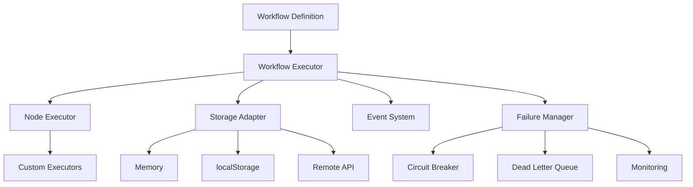

# Introduction to Flows

Flows is a **stateful, secure, JavaScript-embedded DAG (Directed Acyclic Graph) workflow executor** designed specifically for frontend applications. It brings the power of server-side workflow orchestration to the browser, enabling developers to build complex, resilient, and maintainable frontend workflows.

## What is Flows?

Flows solves the challenge of managing complex, multi-step processes in frontend applications. Instead of scattering business logic across components and managing state manually, Flows provides a structured approach to defining, executing, and monitoring workflows.

### Key Characteristics

- **DAG-Based**: Workflows are represented as directed acyclic graphs, ensuring logical execution order
- **Stateful**: Maintains workflow state across browser sessions and page reloads
- **Event-Driven**: Nodes can wait for external events, making workflows reactive to user input or API responses
- **Frontend-First**: Designed for browser environments with no backend dependencies required
- **Enterprise-Grade**: Includes sophisticated failure handling, monitoring, and alerting capabilities

## Why Use Flows?

### Traditional Challenges

Frontend applications often struggle with:

```javascript
// Traditional approach - complex state management
class UserOnboarding {
  constructor() {
    this.step = 1;
    this.userData = {};
    this.isValid = false;
    // ... dozens of state variables
  }

  async handleNextStep() {
    if (this.step === 1) {
      // Validate user info
      if (await this.validateUserInfo()) {
        this.step = 2;
        await this.sendWelcomeEmail();
        this.step = 3;
        // ... complex logic continues
      } else {
        // Handle failure...
      }
    }
    // ... more conditional logic
  }
}
```

### The Flows Approach

```typescript
import { createFlows, createWorkflow } from 'flows';

const onboardingWorkflow = createWorkflow('user-onboarding', 'User Onboarding', [
  {
    id: 'collect-info',
    type: 'user-input',
    inputs: { form: 'user-details' },
    dependencies: [],
  },
  {
    id: 'validate-info',
    type: 'validation',
    inputs: { rules: 'user-validation-rules' },
    dependencies: ['collect-info'],
  },
  {
    id: 'send-welcome-email',
    type: 'email',
    inputs: { template: 'welcome' },
    dependencies: ['validate-info'],
  },
  {
    id: 'setup-preferences',
    type: 'user-preferences',
    inputs: { defaults: true },
    dependencies: ['send-welcome-email'],
    waitForEvents: ['preferences-selected'],
  },
]);

const flows = createFlows({ storage: { type: 'LOCAL_STORAGE' } });
await flows.startWorkflow(onboardingWorkflow);
```

## Core Benefits

### 1. Separation of Concerns

- **Workflow Definition**: Pure data structures describing the process
- **Node Executors**: Reusable logic for different node types
- **State Management**: Handled automatically by Flows
- **Event Handling**: Centralised event system

### 2. Reliability & Resilience

```typescript
const config = {
  storage: { type: StorageType.LOCAL_STORAGE },
  failureHandling: {
    strategy: FailureStrategy.RETRY_AND_DLQ,
    deadLetter: { enabled: true, maxRetries: 3 },
    monitoring: { enabled: true, alertingEnabled: true },
  },
};
```

- **Automatic Retries**: Configurable retry strategies with exponential backoff
- **Circuit Breaker**: Prevent cascading failures
- **Dead Letter Queue**: Handle persistently failing operations
- **Poison Message Detection**: Identify and quarantine problematic workflows

### 3. Developer Experience

- **TypeScript Support**: Full type definitions and IDE support
- **Declarative**: Workflows defined as simple JavaScript objects
- **Testable**: Easy to unit test individual nodes and workflows
- **Debuggable**: Comprehensive logging and state inspection

### 4. Flexibility & Scalability

- **Storage Adapters**: Memory, localStorage, or remote API storage
- **Custom Node Types**: Extend with your own business logic
- **Event Integration**: Connect to any event source
- **Configuration**: Extensive configuration options for different environments

## When to Use Flows

### Perfect For:

✅ **Multi-step user processes** (onboarding, checkout, forms)  
✅ **Complex business workflows** (approval processes, data validation)  
✅ **Event-driven applications** (real-time updates, user interactions)  
✅ **Applications requiring persistence** (survive page reloads, resume later)  
✅ **Enterprise applications** (requiring monitoring, failure handling)  
✅ **Microservice orchestration** (coordinating frontend API calls)  

### Not Ideal For:

❌ Simple, linear processes without state requirements  
❌ Applications with extreme bundle size constraints  
❌ Workflows that require server-side execution  
❌ Real-time streaming data processing  

## Architecture Overview



### Core Components

- **Workflow Executor**: Main orchestration engine
- **Node Executors**: Execute individual workflow nodes
- **Storage Adapters**: Persist workflow state
- **Event System**: Handle asynchronous events
- **Failure Manager**: Comprehensive error handling and monitoring

## Example Use Cases

### 1. E-commerce Checkout

```typescript
const checkoutWorkflow = createWorkflow('checkout', 'E-commerce Checkout', [
  { id: 'validate-cart', type: 'validation', dependencies: [] },
  { id: 'calculate-shipping', type: 'shipping', dependencies: ['validate-cart'] },
  { id: 'apply-discounts', type: 'discount', dependencies: ['calculate-shipping'] },
  { id: 'process-payment', type: 'payment', dependencies: ['apply-discounts'] },
  { id: 'send-confirmation', type: 'email', dependencies: ['process-payment'] },
]);
```

### 2. User Onboarding

```typescript
const onboardingWorkflow = createWorkflow('onboarding', 'User Onboarding', [
  { id: 'collect-profile', type: 'form', waitForEvents: ['form-submitted'] },
  { id: 'verify-email', type: 'email-verification', dependencies: ['collect-profile'] },
  { id: 'setup-preferences', type: 'preferences', dependencies: ['verify-email'] },
  { id: 'tour-walkthrough', type: 'ui-tour', dependencies: ['setup-preferences'] },
]);
```

### 3. Data Processing Pipeline

```typescript
const dataProcessingWorkflow = createWorkflow('data-processing', 'Data Processing', [
  { id: 'fetch-data', type: 'api-call', dependencies: [] },
  { id: 'validate-data', type: 'validation', dependencies: ['fetch-data'] },
  { id: 'transform-data', type: 'transformation', dependencies: ['validate-data'] },
  { id: 'store-results', type: 'storage', dependencies: ['transform-data'] },
]);
```

## Philosophy

Flows is built on several key principles:

### 1. **Declarative over Imperative**
Define *what* should happen, not *how* it should happen.

### 2. **Resilience by Default**
Assume failures will occur and handle them gracefully.

### 3. **Frontend-First Design**
Optimised for browser environments and frontend developer workflows.

### 4. **Progressive Enhancement**
Start simple and add complexity as needed.

### 5. **Developer Experience**
Great tooling, clear APIs, and comprehensive documentation.

## Next Steps

Ready to get started? Here's your journey:

1. **[Installation](./installation.md)** - Set up Flows in your project
2. **[Quick Start](./quick-start.md)** - Build your first workflow
3. **[Core Concepts](./core-concepts.md)** - Understand the fundamental concepts
4. **[Examples](../examples/)** - See real-world examples

---

**Ready to transform how you handle complex frontend processes?** Let's dive into [installation](./installation.md) and get you up and running! 🚀 